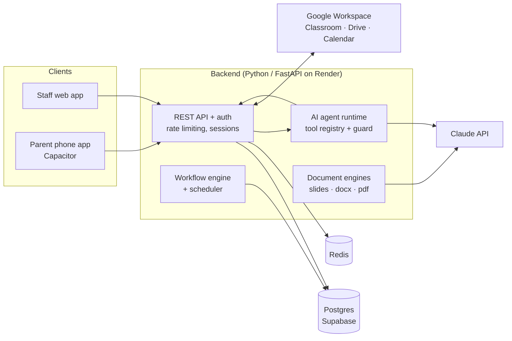

# BC One

**An AI-native school management platform for British-curriculum schools in the Gulf.**
Live in production at [BC Academy International School & Nursery](https://bcacademy.ae), Dubai.
Platform: [apps.bcacad.org](https://apps.bcacad.org)

> **Private source.** The code is private because the platform handles pupil and staff data.
> This repo describes what it does, how it's built, and my role in it.
> Happy to walk through the code live in an interview or demo.

  

  
  &nbsp;
  

Sandbox with demo data. Weekly timetable · customisable Today dashboard · one sign-in for staff, students and parents.

---

## The problem

Schools run on a patchwork: a timetable in one tool, attendance in another,
lesson plans in Word, reports in spreadsheets, parent messages on WhatsApp.
Teachers re-type the same information many times, and leaders can't see the
whole picture. Most "school AI" products are a chatbot bolted onto that mess.

BC One puts it into **one system built around the school's real data**,
with AI that works *inside* those workflows rather than beside them.

## What it does

| Area | Features |
|---|---|
| **Teaching** | Lesson planning against the UK National Curriculum, lesson bank, AI slide generation, assignments, unit calendar |
| **Assessment & reports** | Assessment tracking, CAT4 analysis, AI-assisted report writing, exports to Word/PDF/PowerPoint |
| **Early Years (EYFS)** | Teachers photograph learning; AI suggests matching *Development Matters* statements; a lead reviews and locks the record |
| **School operations** | Timetable import and parsing, daily attendance, behaviour, staff directory, onboarding, workflow engine with scheduler |
| **Parents** | Parent portal and phone app, messaging with automatic translation, club (ECA) sign-up and pricing, consent |
| **In-app AI agent** | An assistant with a tool registry (attendance, timetable, planning, messaging, tasks) and pending-approval steps, so it can act on staff's behalf, but only with a person's confirmation |
| **Leadership** | School improvement tracking, attainment insight, audit trail |

## Architecture

**Stack:** Python · FastAPI · PostgreSQL (Supabase) · Redis · Claude API (Anthropic) ·
Google Workspace APIs · HTML/JS frontend with a tested design-token system ·
Capacitor mobile shell · Render · GitHub Actions

## Scale (March–September 2026)

| | |
|---|---|
| Commits | **3,400+** |
| Backend | **~85,000 lines** of Python, 130+ modules |
| Automated tests | **~6,500** |
| Database migrations | **165** |
| Users | Teachers, leadership and office staff at a Nursery–Year 8 school, plus parents |

## How it's built: an AI-agent engineering team

A small human team ships this with a fleet of **Claude coding agents**, and I
designed the process that keeps that safe:

- **Parallel work slots.** Each agent works in its own git worktree on its own
  branch, so several features move at once without colliding.
- **Two protected branches.** `sandbox` (synthetic data) and `main`
  (production, real pupils). Nobody, including admins and agents, can push to either
  directly; every change is a pull request that must pass CI.
- **AI review at the production gate.** PRs into `main` need passing tests *and*
  an automated AI code review. We dropped the human-approval rule after finding
  that approvals nobody actually read were creating false confidence.
- **Tests as guardrails.** For example, a test fails the build if any dependency
  loses its version ceiling, after a major SDK release reached production unnoticed.

## Engineering highlights

- **Fixing the real curriculum.** A teacher reported missing EYFS objectives. The
  investigation found production held 80 statements where the published framework
  has 291. We replaced the list and re-mapped 52 existing tags, and used data
  fingerprints before and after to prove no teacher's record had changed.
- **Measure before building.** Leaders asked for a table ranking teachers by how many
  Early Years observations they'd recorded. The data showed most teachers hadn't
  started yet, so a ranking would've been meaningless. We built a view that shows
  which children and classes are missing observations instead.
- **Security.** We found and fixed an open-redirect bug (a backslash bypassed the
  `//` check) in three places, including the OAuth callback, and consolidated them
  into one tested module.
- **Data protection.** A DPIA, a processing record, an AI acceptable-use policy and
  UAE data-residency research were written alongside the code, not after it.

## My role

**Founder & product lead.** I set the product direction with school leadership,
design the features with teachers, and build most of the platform myself: about
2,900 of the 3,400+ commits are my work, shipped through the Claude coding agents
I direct. I also own the engineering process described above.

---

[apps.bcacad.org](https://apps.bcacad.org) · [@ayaz-oss](https://github.com/ayaz-oss)
